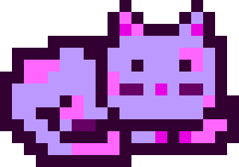

# mooncatparser

### Official MoonCat Generation Library for the MoonCatRescue Ethereum Smart Contract

This library exports a single function `mooncatparser` which takes a 5 byte hex `catId` and returns a 2D array of hex color value strings, or `null` for transparency.

-----

## Browser Usage Example

```html
<script src="mooncatparser.js"></script>
```

```javascript
function generateMoonCatImage(catId, size){
  size = size || 10;
  var data = mooncatparser(catId);
  var canvas = document.createElement("canvas");
  canvas.width = size * data.length;
  canvas.height = size * data[1].length;
  var ctx = canvas.getContext("2d");

  for(var i = 0; i < data.length; i++){
    for(var j = 0; j < data[i].length; j++){
      var color = data[i][j];
      if(color){
        ctx.fillStyle = color;
        ctx.fillRect(i * size, j * size, size, size);
      }
    }
  }
  return canvas.toDataURL();
}
```

-----

## Node Usage Example
(follow the installation instructions for the [node-canvas](https://github.com/Automattic/node-canvas) dependencies)

```bash
$ npm install mooncat canvas@2.0.0-alpha.2
```

```javascript
const Canvas = require('canvas');
const mooncatparser = require("mooncatparser");

function generateMoonCatImage(catId, size){
  var data = mooncatparser(catId);

  var canvas = new Canvas(size * data.length, size * data[0].length);
  var ctx = canvas.getContext('2d');
  for (var i = 0; i < data.length; i++) {
    for (var j = 0; j < data[i].length; j++) {
      var color = data[i][j];
      if (color) {
        ctx.fillStyle = color;
        ctx.fillRect(i * size, j * size, size, size);
      }
    }
  }

  return canvas.toDataURL();
}
```

-----

## Example Output

The catId `0x00f9e605e3` represents the image:



-----

## License

Copyright © 2017 ponderware ltd.

Permission is hereby granted, free of charge, to any person obtaining a copy of this software and associated documentation files (the "Software"), to deal in the Software without restriction, including without limitation the rights to use, copy, modify, merge, publish, distribute, sublicense, and/or sell copies of the Software, and to permit persons to whom the Software is furnished to do so, subject to the following conditions:

Except with the prior written authorization from ponderware ltd., any modifications made to the Software shall not be represented, promoted, or sold as the official or canonical Software or property of MoonCatRescue or ponderware ltd., and this permission notice shall be included in all copies or substantial portions of the Software.

THE SOFTWARE IS PROVIDED "AS IS", WITHOUT WARRANTY OF ANY KIND, EXPRESS OR IMPLIED, INCLUDING BUT NOT LIMITED TO THE WARRANTIES OF MERCHANTABILITY, FITNESS FOR A PARTICULAR PURPOSE AND NONINFRINGEMENT. IN NO EVENT SHALL THE AUTHORS OR COPYRIGHT HOLDERS BE LIABLE FOR ANY CLAIM, DAMAGES OR OTHER LIABILITY, WHETHER IN AN ACTION OF CONTRACT, TORT OR OTHERWISE, ARISING FROM, OUT OF OR IN CONNECTION WITH THE SOFTWARE OR THE USE OR OTHER DEALINGS IN THE SOFTWARE.
